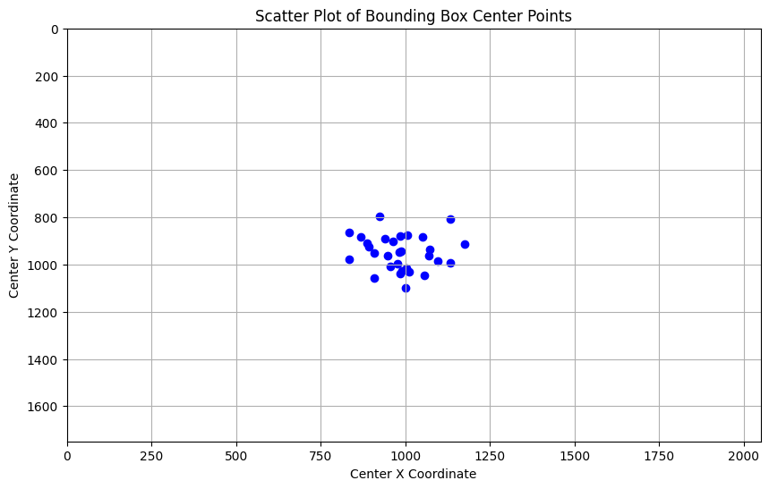
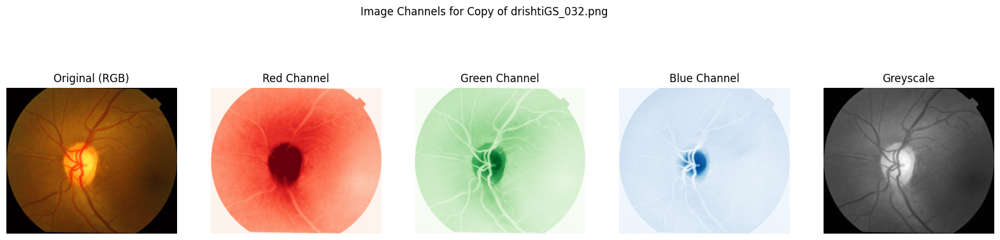
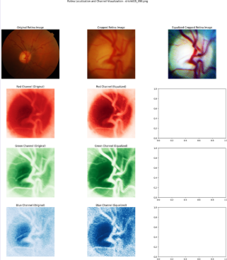
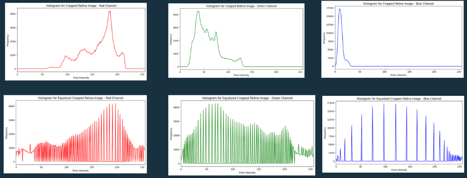
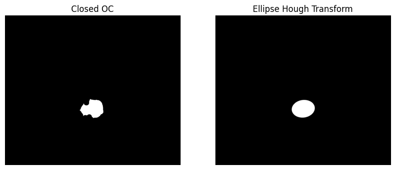

# OD & OC Segmentation from Retinal Fundus Photography

Segmentation of the **Optic Disc (OD)** and **Optic Cup (OC)** from fundus images using classical computer vision methods. Built on the [Drishti-GS](https://cvit.iiit.ac.in/projects/mip/drishti-gs/mip-dataset2/Home.php) dataset.

> Course project — EB3206 Biomedical Image Processing

**Authors:** Dwi Rezky Fahlan · Sola Gracia Rania

---

## Overview

Accurate OD and OC segmentation is a prerequisite for glaucoma screening, where the cup-to-disc ratio (CDR) is the primary diagnostic indicator. This project implements a full classical pipeline — localization → segmentation → post-processing — without deep learning, and documents the EDA findings that informed each design decision.

---

## EDA & Design Decisions

Before building the pipeline, we analyzed the Drishti-GS dataset to understand the structure of OD and OC masks and guide method choices.

### Spatial Distribution of OD Centers



OD centers cluster tightly in a consistent region across all images. This confirmed that a sliding window approach was viable — the OD is reliably located and not arbitrarily positioned. The bounding box size statistics from this analysis (mean area ~116,772px, mean box dimensions ~383×337px) directly informed the sliding window radius of 330px.

### Channel Analysis



Per-channel inspection of the localized OD region showed that the **red channel provides the clearest contrast** between the bright OD region and surrounding retinal tissue. This justified using the red channel as the basis for OD segmentation via Otsu thresholding.

### Preprocessing Chain




Histogram equalization of the localized region spreads the intensity distribution, improving separability between OC and surrounding OD tissue. This informed the preprocessing step applied before OC segmentation.

---

## Pipeline

```
Fundus Image
    │
    ▼
OD Localization        Sliding window (r=330px) on green channel → find max intensity region
    │                  Radius derived from EDA bounding box statistics
    ▼
OD Segmentation        Otsu thresholding on red channel of localized ROI
    │                  Red channel selected based on channel contrast analysis
    ▼
OD Post-Processing     Morphological opening + closing (disk r=30) → Ellipse Hough Transform
    │
    ▼
OC Segmentation        K-means clustering (K=4) on localized OD region
    │                  K range estimated from OC/OD size ratio in EDA; K=4 selected empirically
    ▼
OC Post-Processing     Morphological closing + opening (disk r=30) → Ellipse Hough Transform
```

---

## Results

### Optic Disc (OD)

| Stage | Mean F1 | Min F1 | Max F1 |
|---|---|---|---|
| Segmentation | 0.947 | 0.824 | 0.976 |
| Post-processing (Ellipse) | 0.947 | 0.839 | 0.982 |
| Test set — Segmentation | 0.955 | 0.942 | 0.974 |
| Test set — Ellipse | 0.943 | 0.924 | 0.969 |

OD localization achieves **100% coverage** across all samples.

**Evaluation map** (Green=TP, Black=TN, Red=FN, Yellow=FP):


### Optic Cup (OC)

| Stage | Mean F1 | Min F1 | Max F1 |
|---|---|---|---|
| Segmentation | 0.746 | 0.633 | 0.871 |
| Post-processing (Ellipse) | 0.829 | 0.636 | 0.940 |
| Test set — Segmentation | 0.735 | 0.549 | 0.864 |
| Test set — Ellipse | 0.808 | 0.518 | 0.908 |

Post-processing improves mean OC F1 by ~8 points over raw segmentation.

### Effect of Ellipse Hough Transform



Applying ellipse Hough transform regularizes the segmentation boundary into a smooth elliptical shape, consistent with the known anatomy of the OD and OC.

---

## Notebooks

| Notebook | Description |
|---|---|
| [od_oc_segmentation.ipynb](notebooks/od_oc_segmentation.ipynb) | Clean reproducible version — set `BASE_DIR` and run |
| [Original with outputs](https://drive.google.com/file/d/1iANv89L-kAI6qAQ30JEstjxiFtYe7v7f/view?usp=sharing) | Original notebook with full cell outputs |

Both cover the full pipeline: EDA, OD and OC segmentation experiments, and per-image F1 evaluation.

---

## Dependencies

```
numpy
Pillow
opencv-python
scikit-image
matplotlib
scipy
```

---

## Dataset

[Drishti-GS](https://cvit.iiit.ac.in/projects/mip/drishti-gs/mip-dataset2/Home.php) — 101 fundus images with expert-annotated OD and OC masks.

---

## Limitations

- OD localization iterates over the full image (height × width), which is computationally inefficient
- OC segmentation accuracy is constrained by the classical approach; a deep learning method would likely improve results
- Morphological disk radius and K value were determined empirically and may not generalize to other datasets
